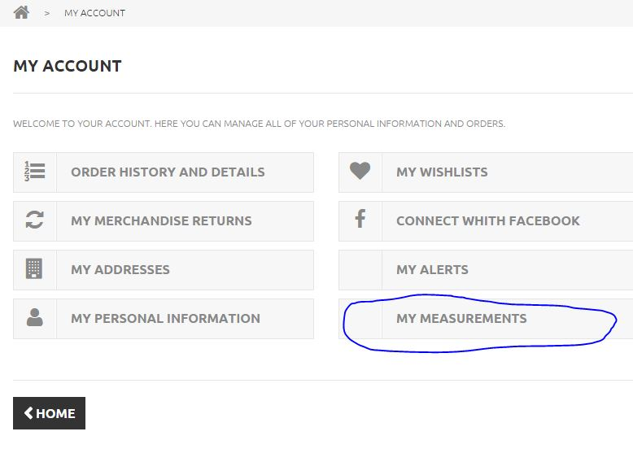
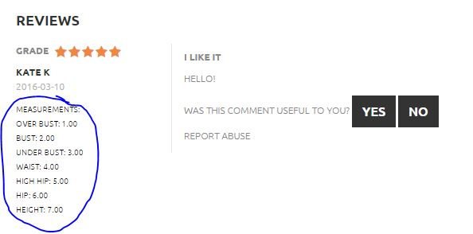

#Measurements Kalon 
## *This is a prestashop module developed for the [Kalon Clothing](http://www.kalonclothing.com/)*
### How does MeasurementsKalon module work?
It adds to the customer account page a new link called "My Measurements"



Users are able to add their measurements onto the site and choose whether they want to hide or show in comments.



###Installation:
1. Make a folder called measurementskalon on your local machine and clone this github repository there. 
2. Zip measurementskalon folder.
3. Login into the admin panel in your site.
4. Navigate to the modules->add new module.
5. Choose the zip file and upload there. 
6. Enable MeasurementsKalon and Product Comments modules.
7. Login to the server and navigate to the modules folder on the server.
8. Find productcomments module folder and make following changes in the ProductComment.php in getByProduct function:

  ```php
    if (!Cache::isStored($cache_id))
		{
			$result = Db::getInstance(_PS_USE_SQL_SLAVE_)->executeS('
			SELECT pc.`id_product_comment`,
			(SELECT count(*) FROM `'._DB_PREFIX_.'product_comment_usefulness` pcu WHERE pcu.`id_product_comment` = pc.`id_product_comment` AND pcu.`usefulness` = 1) as total_useful,
			(SELECT count(*) FROM `'._DB_PREFIX_.'product_comment_usefulness` pcu WHERE pcu.`id_product_comment` = pc.`id_product_comment`) as total_advice, '.
			((int)$id_customer ? '(SELECT count(*) FROM `'._DB_PREFIX_.'product_comment_usefulness` pcuc WHERE pcuc.`id_product_comment` = pc.`id_product_comment` AND pcuc.id_customer = '.(int)$id_customer.') as customer_advice, ' : '').
			((int)$id_customer ? '(SELECT count(*) FROM `'._DB_PREFIX_.'product_comment_report` pcrc WHERE pcrc.`id_product_comment` = pc.`id_product_comment` AND pcrc.id_customer = '.(int)$id_customer.') as customer_report, ' : '').'
			IF(c.id_customer, CONCAT(c.`firstname`, \' \',  LEFT(c.`lastname`, 1)), pc.customer_name) customer_name, pc.`content`, pc.`grade`, pc.`date_add`, pc.title, pc.id_customer
			  FROM `'._DB_PREFIX_.'product_comment` pc
			LEFT JOIN `'._DB_PREFIX_.'customer` c ON c.`id_customer` = pc.`id_customer`
			WHERE pc.`id_product` = '.(int)($id_product).($validate == '1' ? ' AND pc.`validate` = 1' : '').'
			ORDER BY pc.`date_add` DESC
			'.($n ? 'LIMIT '.(int)(($p - 1) * $n).', '.(int)($n) : ''));
			Cache::store($cache_id, $result);
		}
  ```
    Save the file.
9. On the server navigate to the folder themes/yourtheme/modules/productcomments and make these changes in productcomments.tpl file in line 45:

```html
    <div class="comment_author_infos">
    							<strong itemprop="author">{$comment.customer_name|escape:'html':'UTF-8'}</strong>
    							<meta itemprop="datePublished" content="{$comment.date_add|escape:'html':'UTF-8'|substr:0:10}" />
    							<em>{dateFormat date=$comment.date_add|escape:'html':'UTF-8' full=0}</em>
    							<p>{hook h='myNewCoolHook' id_customer_comments=$comment.id_customer}</p>
    </div>
```
Save the file and reset MeasurementsKalon module in the admin panel. 
Done.

###Contact information:
If you have any questions or find bugs, please, feel free to contact me janebarinova@gmail.com.


